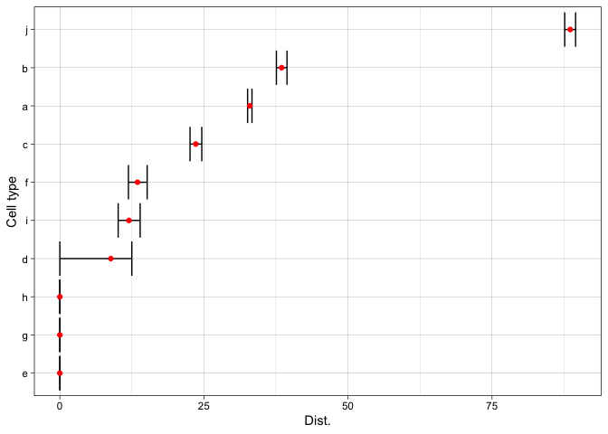
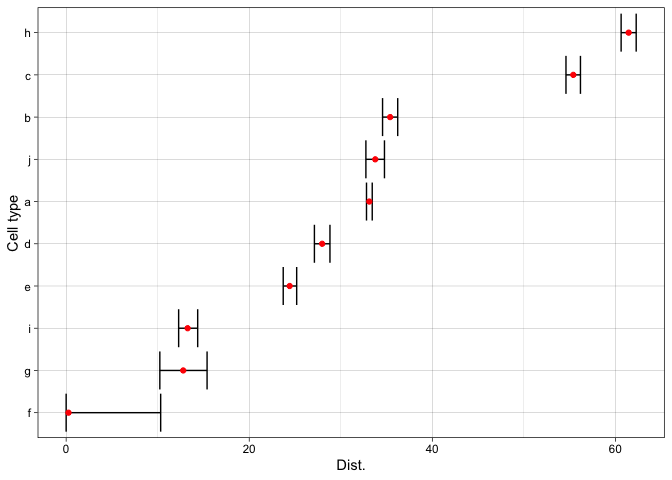

scDist: Robust identification of perturbed cell types in single-cell
RNA-seq data
================
R package version 1.1.2

## System Requirements

`R` is required to use `scDist`. In development, `R` version 4.0.0 and
greater were used, but there may be compatibility with previous
versions.

## Installation

From the R console, `devtools::install_github("phillipnicol/scDist")`.
Installation should take less than a minute on a standard machine.

## Demo

The input to `scDist` is a normalized count matrix and correpsonding
metadata that describes what condition and patient each cell belongs to.
In this demo, we create a simulated dataset with 10 cell types. The demo
should take less than a minute to run on a standard machine. The code is
also modifiable to see how `scDist` performs for different parameter
values.

``` r
library(scDist)
set.seed(1126490984)
```

Generate simulated data with 10 cell types and 5 patients in each group:

``` r
sim <- simData(nct=10,N1=5,N2=5)

dim(sim$Y) #Normalized counts
```

    ## [1] 1000 5100

``` r
rownames(sim$Y) <- 1:1000
head(sim$meta.data)
```

    ##   response patient clusters
    ## 1        1       1        a
    ## 2        1       1        a
    ## 3        1       1        a
    ## 4        1       1        a
    ## 5        1       1        a
    ## 6        1       1        a

Now we apply scDist:

``` r
out <- scDist(sim$Y,sim$meta.data,fixed.effects = "response",
              random.effects="patient",
              clusters="clusters")
```

    ## ================================================================================

The results data frame gives a summary of the estimated distance and
uncertainty for each cell type

``` r
out$results
```

    ##       Dist. 95% CI (low) 95% CI (upper)        p.val
    ## a 33.044137    32.281250       33.82516 0.0000099999
    ## b 10.870614     8.007240       13.73925 0.0048399516
    ## c  9.885715     5.217373       13.39083 0.4479655203
    ## d 15.240428    13.991557       16.58055 0.0000099999
    ## e 18.897089    18.201092       19.64802 0.0000099999
    ## f  0.000000     0.000000        0.00000 0.9478205218
    ## g 33.022750    32.519064       33.55178 0.0000099999
    ## h 22.591648    21.749534       23.49203 0.0000099999
    ## i 16.613041    15.731826       17.54432 0.0000099999
    ## j 16.371930    15.131200       17.60823 0.0000099999

The true distances are

``` r
names(sim$D.true) <- letters[1:length(sim$D.true)]
sim$D.true
```

    ##         a         b         c         d         e         f         g         h 
    ## 31.497609  4.408609  5.153658 10.700209 15.551271  2.764961 31.310492 19.893417 
    ##         i         j 
    ## 13.349565 13.045934

We can also plot the results

``` r
DistPlot(out)
```

<!-- -->

To get a plot of genes that are associated with the perturbation use
`distGenes`:

``` r
distGenes(out, cluster = "a")
```

<!-- -->

## Reference

If you use `scDist` in your work, please cite:

Nicol, P.B., Paulson, D., Qian, G., Liu, X.S., Irizarry, R.A., and Sahu,
A.D. (2024). Robust identification of perturbed cell types in
single-cell RNA-seq data. *Nature Communications*. Vol 15(7610).
<https://doi.org/10.1038/s41467-024-51649-3>.
